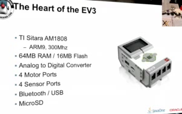

# Java
All about Java

# Imágenes

# Código para leer un CSV
* [  CSV  ](./codes/csv.java) 
# RMI
* [RM1](https://github.com/luisreylara/java/blob/main/RMI/Readme.md)
# Java & OpenCV
*  [OpenCV](https://github.com/luisreylara/OpenCv)

# Java - Embedded Channels

# Herat of EV3 (LEGO Mindstorm) 

