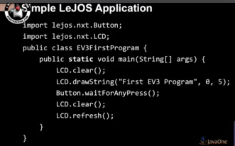

# Java
All about Java

# Código para leer un CSV
* [  CSV  ](./codes/csv.java) 
# RMI
* [RM1](https://github.com/luisreylara/java/blob/main/RMI/Readme.md)
# Java & OpenCV
*  [OpenCV](https://github.com/luisreylara/OpenCv)

# Java - Embedded Channels

# Heart of EV3 (LEGO Mindstorm) 
* 
*   
* 
* 
* [Lejos for Java Ev3](https://lejos.sourceforge.io/)

# JTable con imagenes 
* 
* 
